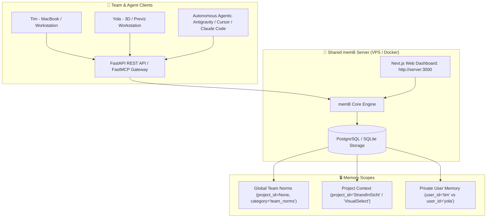

# Master Execution Plan: memB Production Hardening & Full Mem0 Parity

**Version:** 2.0  
**Status:** Ready for Execution  
**Target Systems:**
- [`hybridlabor-api/memB`](file:///Users/timrennings/bdb-dev/memB)
- [`bdb-dev-optimized-agent-skills`](file:///Users/timrennings/bdb-dev/bdb-dev-optimized-agent-skills)
- [`bdb-dev-optimized-antigravity-skills`](file:///Users/timrennings/bdb-dev/bdb-dev-optimized-antigravity-skills)
- [`bdb-dev-optimized-agent-skills-basic`](file:///Users/timrennings/bdb-dev/bdb-dev-optimized-agent-skills-basic)
- [`bdb-dev-tool-installer`](file:///Users/timrennings/bdb-dev/bdb-dev-tool-installer)

---

## 1. System Overview & Upstream Comparison

| Component | Upstream Mem0 (Cloud SaaS) | memB (Our Local & Self-Hosted Fork) | Parity Status |
| :--- | :--- | :--- | :--- |
| **Embeddings** | Cloud API (OpenAI / Cohere) | Bundled 23MB ONNX (`all-MiniLM-L6-v2`) | ✅ **100% Offline** |
| **Vector Database** | Qdrant Cloud / Pinecone | Embedded SQLite (`memb_vectors` + FTS5) | ✅ **Zero-Daemon** |
| **Web Dashboard** | Hosted at `app.mem0.ai` | Included in repo at [`memB/server/dashboard/`](file:///Users/timrennings/bdb-dev/memB/server/dashboard) | ✅ **Full Next.js UI** |
| **Team / Shared Memory** | Cloud Organization RBAC | Multi-Tenant REST API at [`memB/server/`](file:///Users/timrennings/bdb-dev/memB/server) | ✅ **Self-Hostable** |
| **Coding Taxonomy** | 17 Development Categories | Currently 4 Categories (`godmode`, `media`, `web`, `software`) | 🔄 **Adopting 17 Cats** |
| **MCP Tool Surface** | 9 Extended MCP Tools | Currently 4 Tools (`add`, `search`, `list`, `delete`) | 🔄 **Expanding Surface** |

---

## 2. Shared Team Memory Architecture (Server Mode)

When self-hosted on a server (VPS / Docker / Cloud), memB supports shared memory across team members and autonomous agents:

---

## 3. Implementation Roadmap (4 Phases)

### Phase 1: SQLite Concurrency (WAL Mode) & FTS5 BM25 Hybrid Search
* **Target File:** [`memb/vector_stores/numpy_flat.py`](file:///Users/timrennings/bdb-dev/memB/memb/vector_stores/numpy_flat.py)
* **Tasks:**
  1. Enable `PRAGMA journal_mode = WAL;`, `PRAGMA synchronous = NORMAL;`, and `PRAGMA busy_timeout = 30000;` on all database connections to prevent multi-agent file locks.
  2. Create virtual table `memb_fts` using `FTS5` to index raw text.
  3. Implement `keyword_search()` in `NumPyFlat` returning BM25 relevance scores for exact code symbols (variable names, ports, CLI flags).

### Phase 2: Upstream 17 Coding Categories & Extraction Prompts
* **Target Files:** [`memb/configs/prompts.py`](file:///Users/timrennings/bdb-dev/memB/memb/configs/prompts.py), [`mcps/memb-mcp/run.py`](file:///Users/timrennings/bdb-dev/bdb-dev-optimized-agent-skills/mcps/memb-mcp/run.py)
* **Tasks:**
  1. Add the 17 upstream development categories:
     `architecture_decisions`, `bug_fixes`, `coding_conventions`, `tooling_setup`, `anti_patterns`, `task_learnings`, `user_preferences`, `dependency_decisions`, `performance_findings`, `security_constraints`, `testing_patterns`, `data_model`, `api_contracts`, `deployment_runbook`, `team_norms`, `domain_glossary`, `experiment_results`.
  2. Update prompt extraction rules so facts are automatically classified into these categories when `infer=True`.

### Phase 3: FastMCP Tool Expansion & Resilient Fallback
* **Target File:** [`mcps/memb-mcp/run.py`](file:///Users/timrennings/bdb-dev/bdb-dev-optimized-agent-skills/mcps/memb-mcp/run.py)
* **Tasks:**
  1. Expand FastMCP tool definitions:
     - `add_memory`: Intelligent LLM extraction with instant offline fallback (`infer=False`).
     - `search_memory`: Hybrid dense vector + BM25 search across user/project scopes.
     - `get_memory`: Retrieve single memory by UUID.
     - `update_memory`: Update existing memory text/metadata.
     - `list_memories`: Paginated list with category/project filtering.
     - `delete_memory`: Delete by UUID.
     - `delete_all_memories`: Scoped bulk deletion.
     - `list_entities`: List all projects, users, and categories.

### Phase 4: Ingestion Deduplication & Multi-Repo Synchronization
* **Target Files:** [`memb_ingest.py`](file:///Users/timrennings/bdb-dev/memB/memb_ingest.py), [`memb_auto_inject.py`](file:///Users/timrennings/bdb-dev/memB/memb_auto_inject.py)
* **Tasks:**
  1. Fix `m.get('document')` $\to$ `m.get('memory')` in `memb_auto_inject.py`.
  2. Add `MD5(source + content)` deduplication to `memb_ingest.py` so re-ingestion updates existing records without bloating the database.
  3. Standardize chunk size to $1,000\text{--}1,200$ chars with $150$-char overlap.
  4. Synchronize all changes and commit Git snapshots across all 5 repositories.

---

## 4. Verification & Testing

- [ ] Multi-agent concurrent write stress-test (zero `sqlite3.OperationalError`).
- [ ] Technical symbol search benchmark (verifying FTS5 BM25 matches).
- [ ] Multi-category categorization test.
- [ ] Clean output in `.cursor/rules/999_memb_context.mdc` (zero `None` values).
- [ ] Idempotent re-ingestion (database size remains stable).
- [ ] All 5 ecosystem Git repositories committed.
